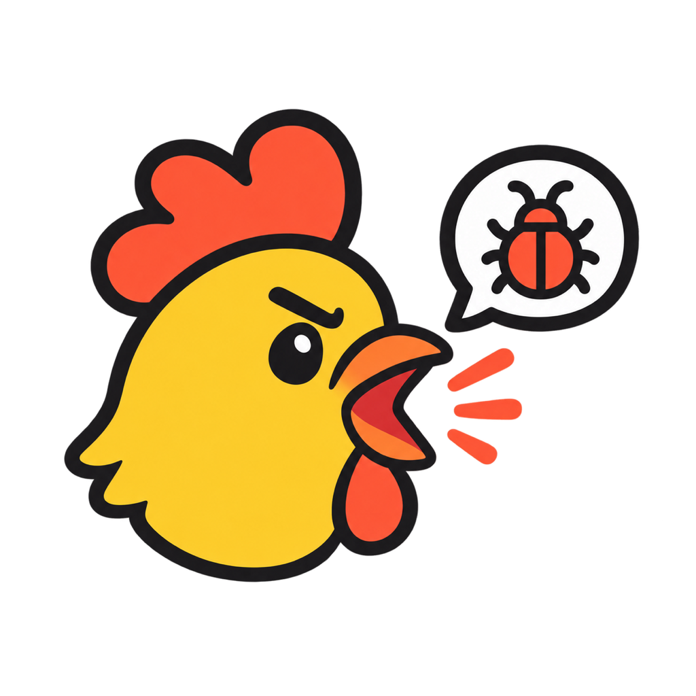

<p align="center"></p>
<h1 align="center">吐槽鸡 blurt 🐔</h1>
<p align="center"><b>边看边说，AI 全懂。</b><br>
录屏 + 语音，想到哪说到哪，coding agent 帮你整理成问题单、想法清单和待办。<br>
<a href="README.md">English</a> · 支持 Claude Code、Codex 等所有能装 skill 的 agent</p>

---

**光靠语音没有眼睛，截图打字又太慢。** 把想法告诉 AI 最自然的方式，是像跟旁边的同事一样：指着屏幕说。
吐槽鸡就把这个过程录下来，剩下的交给你的 agent：

- 把东拉西扯的半小时拆成一条条独立的事项，跳来跳去、说错改口都没关系
- 给每条挑出最合适的截图，并根据你当时鼠标的真实位置把问题框出来
- 写清楚实际效果和预期效果、复现步骤、负责人，还有**最可能出问题的代码位置**
- 打开一个审核页，用键盘一条条过
- 导出到飞书多维表格、GitHub、Linear 或 Markdown，或者直接开始修

> 以前要截图、画红框、填表格，花两天才反馈完的问题，现在半小时讲完。

## 可以用来吐槽什么

| | |
|---|---|
| 🐞 **打磨 vibe coding 出来的产品** | AI 通宵做完的东西，你挨个页面点一遍、边用边吐槽，拿到一份带代码定位的问题清单，直接交给 AI 去改。这是鞭策 AI 把活干完的最快方式。 |
| 💡 **边逛边记灵感** | 「这个网站的引导做得好……这个定价页也不错……」整理出一份想法清单：每个想法是什么、为什么想到、灵感来自哪里、下一步做什么，再附一页总览。 |
| 🤝 **谁都能反馈** | 产品、设计、运营、客户，不需要有代码库，用 Blurt App 录好把视频发过来就行。开发那边的 agent 结合代码来处理。 |
| 🔎 **调研和讲解** | 竞品走查、用户研究、「这个是怎么运作的」，整理成带截图佐证的笔记和结论。 |

一段录屏里可以混着讲，每一条是问题、想法、笔记还是待办，由 agent 自己判断。团队也可以加自己的
[模板（lens）](skills/blurt/reference/schema.md#custom-lenses)，比如 `ux-research`、`sales-call`、`sop`。

## 安装

```bash
npx skills add AGIHunt/blurt
```
<sub>Claude Code 也可以用 <code>/plugin marketplace add AGIHunt/blurt</code>，或者直接把本仓库地址丢给你的 agent，让它帮你装。</sub>

然后在任意项目里对 agent 说 **「开始吐槽」**。首次运行会按你的电脑选好语音模型，并装好菜单栏里的 **Blurt** App。

## 用起来是什么样

1. **框出要录的区域**：拖拽框选、单击选中某个窗口，或者全屏。标签栏、收藏夹这些都不会被录进去。
2. **3-2-1 倒计时后开始说**。屏幕上有一个很小的悬浮条，显示计时和音量，带 ⏸ 暂停、↺ 重录、**完成** 按钮，
   悬浮条本身不会被录进去。快捷键：`⌥⇧P` 暂停，`⌥⇧S` 完成。
3. **点「完成」就可以去干别的了**。agent 会在本地识别语音、整理事项，然后打开审核页。
4. **像刷短视频一样审核**：`A` 保留 · `X` 丢弃 · `J/K` 下一条/上一条 · `Z` 撤销 · `G` 列表 · `V` 总览。
   审完可以导出，也可以直接说「帮我改掉」。

**常驻后台**：Blurt App 待在菜单栏里，在任何地方按 `⌥⇧R` 开始录制，再按一次结束，`⌥⇧B` 打开菜单。
录屏会存进工作区，默认是 `~/Blurt`，也可以绑定到某个项目，这样 agent 能结合代码来处理。打开「录完自动整理 →
Claude Code / Codex」后，每段录屏都会在后台自动整理，好了审核页会自己弹出来。

## 一个人用，团队也能用

- **一个人**：录完之后，同一个仓库里的 agent 整理完直接改，不用填表，也不用复制粘贴。
- **团队**：没有代码库的同事直接[下载 macOS 版 Blurt](https://github.com/AGIHunt/blurt/releases/latest)
  （解压后第一次右键 →「打开」），按 `⌥⇧R` 就能录。谁都可以用 App 录，录完在「最近的录制 → 拷贝视频」，直接粘贴到飞书或 Slack 里发出去；也可以绑定一个
  共享的项目文件夹。每条事项会保留是谁录的，导出时直接写进团队现有的表格，沿用你们自己的列名。

## 背后是怎么做的

- **语音识别优先在本地跑**：默认用 [SenseVoice](https://github.com/FunAudioLLM/SenseVoice)（通过 sherpa-onnx 运行），
  约 240MB，普通 CPU 就很快，中英混说效果好；Apple Silicon 或 NVIDIA 显卡上可以用 Whisper；也可以用你自己的
  Groq、OpenAI 或百炼 Key。默认不会上传任何内容。
- **原生录屏**：macOS 用 ScreenCaptureKit，音画同步误差在一帧以内；Windows 用 Tk + ffmpeg。
- **确定的事交给脚本，判断交给模型**：录屏、识别、抽帧、审核页、导出由脚本完成；怎么拆、怎么写、怎么判断全交给
  agent（见 [SKILL.md](skills/blurt/SKILL.md)），所以能适应你的产品、你的语言和你的团队。
- **说什么语言都行**：中文、英文、日文……说什么语言，整理出来就是什么语言。

## 路线图

浏览器端采集（把控制台报错、失败的网络请求和视频时间对齐）· 画圈高亮手势 · Windows 托盘 App · 托管语音识别 API ·
更多模板和导出方式 · 最终做成一个能看、能听、能帮你推进项目的个人助理。详见 [TODO.md](TODO.md)。

<p align="center"><sub>MIT · 出品 <a href="https://github.com/AGIHunt">AGI Hunt</a> · 🐔 如果吐槽鸡帮你省了一天，点个 ⭐ 让更多人看到</sub></p>
